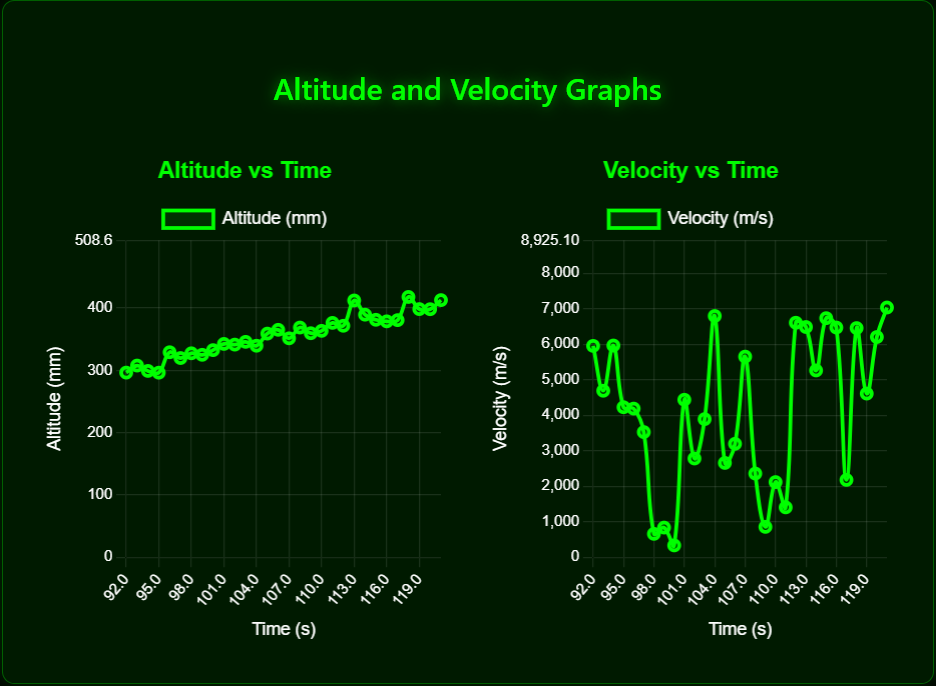
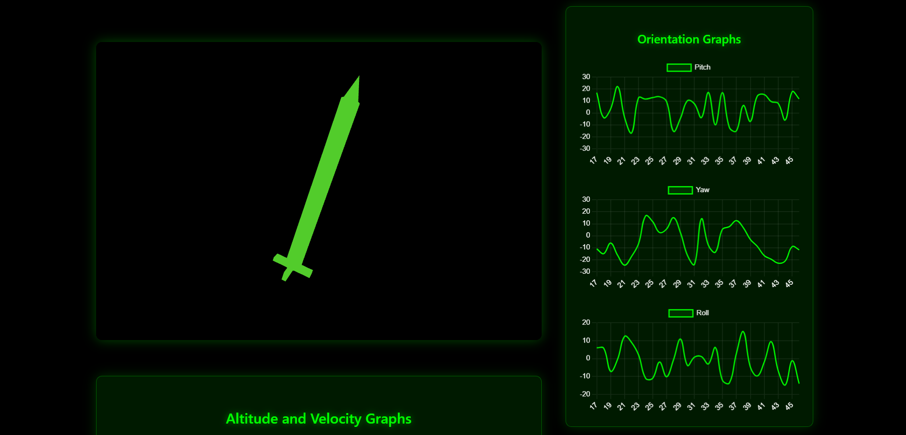

# Rocket Telemetry Visualization UI

This project is an interactive web application for visualizing rocket telemetry data in real time. It features a 3D rocket model that updates its orientation (pitch, yaw, roll) and dynamic charts for altitude and velocity, all based on data from a CSV file.

## Features

- **3D Rocket Visualization:** View the rocket's orientation in real time using Three.js via React Three Fiber.
- **Live Graphs:** Real-time line charts for pitch, yaw, roll, altitude, and velocity.
- **CSV Data Driven:** Reads telemetry data from a CSV file (`public/dummy_rocket_data_with_velocity.csv`).
- **Modern UI:** Neon-themed, responsive, and visually appealing interface.

## Demo


*Altitude and Velocity Graphs*


*Rocket Orientation Visualization*

## Getting Started

### Prerequisites
- Node.js (v16 or newer recommended)
- npm

### Installation
1. Clone the repository:
   ```bash
   git clone https://github.com/TejasNeswi/Rocket-ui.git
   cd rocket-ui
   ```
2. Install dependencies:
   ```bash
   npm install
   ```

### Running the App
Start the development server:
```bash
npm start
```
Open [http://localhost:3000](http://localhost:3000) in your browser.

### Building for Production
```bash
npm run build
```

## Data Format
The app expects a CSV file at `public/dummy_rocket_data_with_velocity.csv` with the following columns:

```
timestamp,pitch,yaw,roll,altitude,velocity
0,2.75,19.22,-10.46,24.12,2996.32
1,23.17,-12.1,-11.66,37.59,7605.71
...
```
- **timestamp:** Time in seconds
- **pitch, yaw, roll:** Orientation angles in degrees
- **altitude:** Altitude in millimeters
- **velocity:** Velocity in meters per second

## Project Structure
- `src/App.js` - Main application logic and UI
- `src/index.js` - Entry point
- `public/dummy_rocket_data_with_velocity.csv` - Sample telemetry data

## Dependencies
- [React](https://reactjs.org/)
- [@react-three/fiber](https://docs.pmnd.rs/react-three-fiber/getting-started/introduction)
- [@react-three/drei](https://docs.pmnd.rs/drei/introduction)
- [three.js](https://threejs.org/)
- [chart.js](https://www.chartjs.org/)
- [react-chartjs-2](https://react-chartjs-2.js.org/)

## Customization
- To use your own data, replace `public/dummy_rocket_data_with_velocity.csv` with your telemetry file in the same format.

## License
[MIT](LICENSE)
